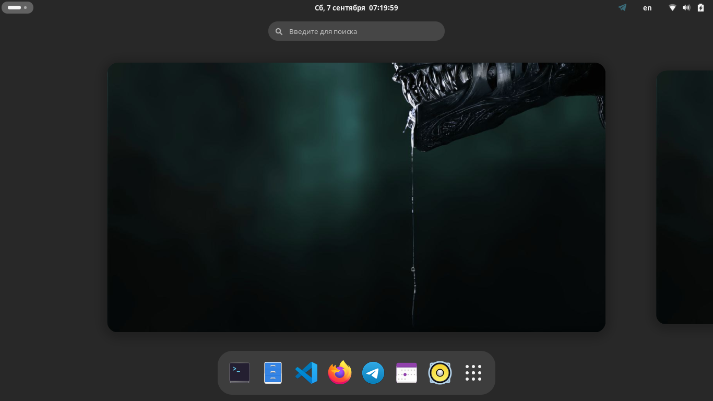

# ❄️ NixOS configuration с Home Manager

Конфигурация **NixOS** на основе flakes для нескольких систем. Системные настройки описаны в [`flake.nix`](flake.nix) и [`nixos/`](nixos/), пользовательские — через **Home Manager** в [`home-manager/`](home-manager/).

Десктоп построен на связке **Niri + Noctalia**: композитор Wayland (скроллящийся тайлинг) и нативный десктоп-шелл (бар, уведомления, контрольная панель). Вход — графический **Noctalia Greeter** на основе `greetd`.

## Архитектура

- **nixos-master** — основная рабочая система (пользователь `master`).
- **nixos-mama** — вторая система (пользователи `master` и `mama`).
- **nixpkgs** — нестабильная ветка (`nixos-unstable`) для свежих пакетов и поддержки Noctalia v5+.
- Пользователи настроены через **Home Manager** (`homeConfigurations.master`, `homeConfigurations.mama`).

### Десктоп

| Компонент | Назначение |
|-----------|------------|
| **Niri** | Композитор Wayland (тайлинг, скроллящиеся рабочие пространства) |
| **Noctalia** | Десктоп-шелл: бар, уведомления, launcher, контрольная панель |
| **Noctalia Greeter** | Графический вход на базе `greetd` |

### Пользовательский софт (минимум)

Из графических приложений оставлены только:
- **VS Code** с плагинами: Markdown lint, Nix IDE, Docker, Python, Remote SSH, YAML, русский языковой пакет, а также AI-ассистенты **SourceCraft Code Assistant** (Yandex) и **Koda**;
- **yandex-browser-stable** (последняя версия из репозитория Яндекса).

Остальной инструментарий — продуктивные CLI-утилиты (micro, tmux, ripgrep, fd, fzf, bat, eza, zoxide, btop, lazygit, jq, docker и др.).

## Требования

- Установленная система **NixOS** с включёнными flakes:
  ```bash
  nix.settings.experimental-features = [ "nix-command" "flakes" ];
  ```
- `git`.

## Установка из git

Клонируйте репозиторий в домашнюю директорию (путь `~/.nixos-config` используется в алиасах Zsh):

```bash
cd
git clone https://github.com/mrscrew/.nixos-config.git
cd ~/.nixos-config
```

### Установка системы на новую машину

```bash
sudo nixos-install --root /mnt --flake .#nixos-master
```

Для второй системы — `--flake .#nixos-mama`.

### Применение системных настроек

```bash
sudo nixos-rebuild switch --flake .#nixos-master
```

### Применение пользовательских настроек

```bash
home-manager switch --flake .#master     # пользователь master
home-manager switch --flake .#mama       # пользователь mama
```

> **Замечание.** Если `home-manager` не установлен в профиле, выполните первый пересбор после развёртывания системы, либо установите его через `nix profile install nixpkgs#home-manager`.

## Структура репозитория

```
flake.nix                     # входы, системы, конфигурации Home Manager, кэш Noctalia
nixos/
  common.nix                  # общие настройки для всех хостов (i18n, nix.*, unfree)
  packages.nix                # системные сервисы, CLI-утилиты, шрифты
  hosts/
    nixos-master/              # конфигурация хоста + аппаратная часть
    nixos-mama/
  modules/                    # модули NixOS
    bundle.nix                # агрегатор импорта модулей
    niri-noctalia.nix         # Noctalia + Noctalia Greeter
    bootloader.nix, sound.nix, nm.nix, zram.nix, ... 
home-manager/
  users/
    master/                   # home.nix, zsh.nix, обои
    mama/
  modules/                    # модули Home Manager
    cursor.nix, git.nix, htop.nix
    yandex-browser/           # локальная сборка Яндекс.Браузера
plans/                        # документация: план рефакторинга и миграции
```

## Полезные команды

### Проверка флейка

```bash
nix flake check              # валидность флейка
nix flake show               # список выходов (системы, home-configurations)
nixos-rebuild dry-build --flake .#nixos-master   # сухая проверка без применения
```

### Обновление входов (inputs)

```bash
nix flake update             # обновить все входы
nix flake update noctalia    # обновить конкретный вход
```

### Очистка системы

```bash
sudo nix-collect-garbage -d  # удалить старые поколения и мусор
```

GC запускается и автоматически (еженедельно, старше 1 недели) — см. [`nixos/common.nix`](nixos/common.nix).

### Алиасы Zsh (для `master`)

```bash
rb    # nixos-rebuild switch --flake ~/.nixos-config.#nixos-master
hms   # home-manager switch --flake ~/.nixos-config.#master
upg   # полное обновление каналов и пересборка
gc    # очистка профиля пользователя и системы
flks  # nix flake show
flkc  # nix flake check
flku  # nix flake update
conf  # открыть конфигурацию хоста
pkgs  # открыть список пакетов
```

## Важные замечания

### Несвободные и небезопасные пакеты

- Включён `allowUnfree = true` (см. [`nixos/common.nix`](nixos/common.nix)).
- **yandex-browser-stable** собирается из локальной derivation и помечен как небезопасный (`knownVulnerabilities`), поэтому задан в `permittedInsecurePackages` с точной версией `26.6.1.1083-1` в конфигурациях Home Manager.

### Бинарный кэш Noctalia

Подключён Cachix-кэш `noctalia.cachix.org` во [`flake.nix`](flake.nix) и [`common.nix`](nixos/common.nix), чтобы не пересобирать шелл из исходников.

### Версия состояния

`system.stateVersion = "24.05"` сохранён как был при первом развёртывании. Менять его не рекомендуется после первого включения системы.

## Скриншот


