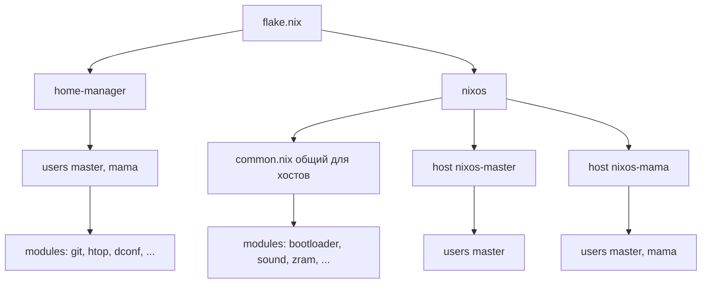

# План рефакторинга конфигурации NixOS

## 1. Обзор проекта

Проект представляет собой конфигурацию NixOS на основе flakes, управляющую двумя системами — **nixos-master** и **nixos-mama** — с использованием Home Manager для настройки пользователей.

Текущая структура:

```
flake.nix                 — точка входа, определяет системы и конфигурации Home Manager
disko.nix                 — схема разметки диска (не подключена к flake, к удалению)
nixos/
  packages.nix            — пакеты, сервисы, шрифты (смешано)
  hosts/
    nixos-master/configuration.nix
    nixos-master/hardware-configuration.nix
    nixos-mama/configuration.nix
    nixos-mama/hardware-configuration.nix
  modules/                — модули NixOS (bootloader, sound, nm, zram, ...)
    bundle.nix            — агрегатор импорта модулей
    nixos-master-users.nix
    nixos-mama-users.nix
home-manager/
  users/
    master/home.nix, zsh.nix
    mama/home.nix, zsh.nix
  modules/                — модули Home Manager (cursor, git, htop, qt, dconf)
    bundle.nix
    orca-slicer/          — локальный пакет
    hiddify-next/         — локальный пакет
```

## 2. Выявленные проблемы

### 2.1. Критические ошибки

| № | Файл | Проблема |
|---|------|----------|
| 1 | [`nixos/packages.nix`](../nixos/packages.nix:65) | Отсутствует запятая между элементами списка `libsForQt5.qt5ct` и `adwaita-qt` — синтаксическая ошибка Nix, сборка упадёт |
| 2 | [`disko.nix`](../disko.nix:16) | Не подключён к flake и не используется, при этом содержит неверную точку монтирования ESP `/boot` (реально — `/boot/efi`). Решение: удалить |

### 2.2. Дублирование кода

- Конфигурации хостов [`nixos-master`](../nixos/hosts/nixos-master/configuration.nix) и [`nixos-mama`](../nixos/hosts/nixos-mama/configuration.nix) практически идентичны (отличаются только `hostName`). Блоки `i18n`, `nix.gc`, `nix.settings`, `nixpkgs.config` повторяются полностью.
- Конфигурации Zsh [`master/zsh.nix`](../home-manager/users/master/zsh.nix) и [`mama/zsh.nix`](../home-manager/users/mama/zsh.nix) дублируют общую логику (`ll`, `hms`, `history`, `oh-my-zsh`).
- Пользователь `master` определён и в [`nixos-master-users.nix`](../nixos/modules/nixos-master-users.nix), и в [`nixos-mama-users.nix`](../nixos/modules/nixos-mama-users.nix) с разными описаниями («Хозяин» и «Админ»).

### 2.3. Структурные проблемы

- `nixpkgs-stable` объявлен во входах [`flake.nix`](../flake.nix:7), но нигде не используется.
- Файл [`packages.nix`](../nixos/packages.nix) содержит не только пакеты, но и сервисы, программы и шрифты — название вводит в заблуждение.
- Дублирование `gsconnect`: установлен и через `programs.kdeconnect.package`, и напрямую в `systemPackages`.
- `zram-generator` установлен в пакетах, хотя есть отдельный модуль [`zram.nix`](../nixos/modules/zram.nix).
- Тема Numix установлена и системно в [`packages.nix`](../nixos/packages.nix), и через курсор в [`cursor.nix`](../home-manager/modules/cursor.nix) — избыточность.
- Модули Home Manager (`git`, `htop`, `dconf`) содержат значения, привязанные к пользователю `master` (имя в git, путь к обоям), но лежат в общем `bundle.nix` — при применении к другому пользователю дадут неверные настройки.
- Жёстко зашит путь `~/.nixos-config` в алиасах Zsh, который не совпадает с фактическим расположением репозитория.
- Непоследовательность редактора: [`env.nix`](../nixos/modules/env.nix) задаёт `EDITOR=nano`, а в Zsh у `mama` используется `nvim`.

### 2.4. Особенности аппаратных конфигураций

- Хосты используют разные файловые системы: `master` — ext4 + swap с `boot.resumeDevice`, `mama` — btrfs с `subvol=@` и без swap. Любой общий модуль хоста не должен затрагивать `fileSystems` и `swapDevices`.
- Оба хоста используют Intel GPU и `vpl-gpu-rt`, что также дублируется в `hardware-configuration.nix`.

### 2.5. Прочее

- Внутри модулей много закомментированного кода (autoLogin, драйверы, videoDrivers) — засоряет конфигурацию.
- Описание flake на английском при требовании русского языка.
- Отсутствует комментарий-документация о назначении модулей и соглашениях.

## 3. Предлагаемая целевая структура

```
flake.nix
nixos/
  common.nix                    # НОВОЕ: общее для всех хостов (i18n, nix.*, unfree)
  packages.nix                  # переименовать → system-packages.nix или apps.nix
  users/
    master.nix                  # общее определение пользователя master
    mama.nix
  hosts/
    nixos-master/configuration.nix   # только hostName + импорты
    nixos-mama/configuration.nix
  modules/                      # без изменений (bundle, bootloader, ...)
home-manager/
  users/
    master/home.nix, zsh.nix
    mama/home.nix
  modules/                      # без изменений
```

Примечание: [`disko.nix`](../disko.nix) удаляется и в целевую структуру не входит.

## 4. Этапы рефакторинга

### Этап 1. Исправление критических ошибок и удаление disko.nix
- Добавить недостающую запятую в [`packages.nix`](../nixos/packages.nix).
- Удалить [`disko.nix`](../disko.nix) как неиспользуемый файл.

### Этап 2. Выделение общего модуля хоста
- Создать [`nixos/common.nix`](../nixos/common.nix) с блоками `i18n`, `nix.gc`, `nix.settings`, `nixpkgs.config`, отключением root-пароля. Без `fileSystems` и `swapDevices`.
- Упростить `configuration.nix` обоих хостов до `hostName` и импортов.

### Этап 3. Дублирование пользователей и Zsh
- Вынести определение пользователя `master` в отдельный модуль, использовать его в обоих хостах.
- Создать общий модуль Zsh (базовая логика, история, oh-my-zsh) с переопределяемыми алиасами через параметр или через отдельные файлы алиасов.

### Этап 4. Наведение порядка в пакетах и модулях
- Переименовать/разделить `packages.nix` по назначению (пакеты, сервисы, шрифты).
- Убрать дублирование `gsconnect` и `zram-generator`.
- Вынести зависимые от пользователя модули (`git`, `dconf`, `htop`) из общего `bundle.nix` в точечные импорты соответствующего пользователя.

### Этап 5. Очистка flake
- Удалить неиспользуемый вход `nixpkgs-stable`.
- Привести `description` к русскому языку.

### Этап 6. Устранение жёстких путей и несогласованностей
- Заменить `~/.nixos-config` на актуальное значение либо на переменную.
- Унифицировать выбор редактора (nano/nvim) по пользователям.
- Удалить закомментированный код.

## 5. Диаграмма целевой архитектуры



## 6. Приоритеты и риски

1. **Сначала критичное исправление** (Этап 1, п.1) — без него сборка невозможна.
2. Хосты используют разные файловые системы (`master` — ext4 + swap, `mama` — btrfs + subvol). Общий модуль хоста не должен затрагивать `fileSystems` и `swapDevices`.
3. Рефакторинг выполняем небольшими шагами, после каждого шага запускаем `nix flake check` и `nixos-rebuild build` на хосте.
4. Локальные пакеты [`orca-slicer`](../home-manager/modules/orca-slicer/default.nix) и [`hiddify-next`](../home-manager/modules/hiddify-next/default.nix) не трогаем без необходимости — риск поломки пользовательских сборок.

## 7. Проверка результатов

- `nix flake check` — валидность флейка.
- `nixos-rebuild dry-build` на каждом хосте.
- Визуальный обзор: отсутствие дублирующих блоков, согласованность алиасов и редакторов.